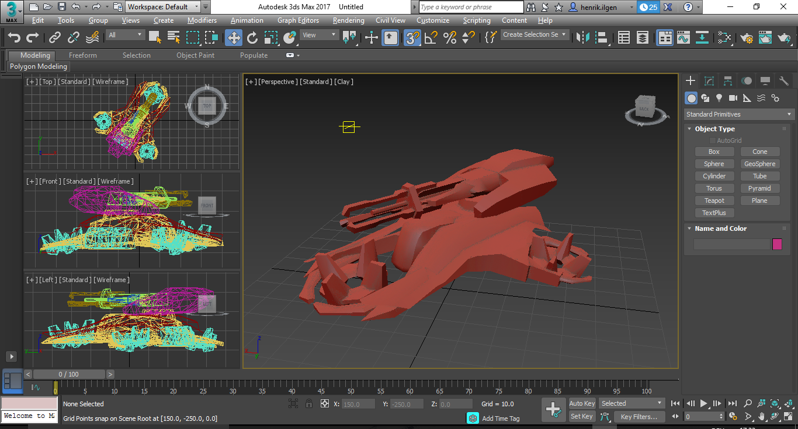

# KFR and STD 3d model parser

\*.kfr and \*.std are file formats used by Polish video game developer Reality Pump Studios in their 
2005 game [Earth 2160](https://en.wikipedia.org/wiki/Earth_2160). Both formats encode 3d models.

The goal of this project is to implement a parser capable of reading most (if not all) meshes
from \*.kfr and \*.std files in Earth 2160. 

## Obtaining \*.kfr and \*.std files

No game files are contained in this project; however, anyone interested in this project can extract
files from their legally acquired copy of Earth 2160 using the [WDPackager](http://www.moddb.com/games/earth-2150-escape-from-the-blue-planet/downloads/earth-2150-wd-packager)
tool. The tool is capable of extracting \*.wd files as used in most of Reality Pump's games
(such as the Earth 2150 trilogy and Earth 2160).

The KFR and STD parser, however, can only read the file format used by Earth 2160 - Specifically, 
it is not (yet) compatible to the \*.msh files from Earth 2150.

## Using this program

As of now, this solution only contains a single working project: The *KfrBinaryReaderConsole*.
The *KfrBinaryReaderConsole* is a command-line tool that recursively inspects a specified directory,
converting any \*.kfr and \*.std files it encounters. The meshes from these files are then parsed
and dumped in [Wavefront OBJ](https://en.wikipedia.org/wiki/Wavefront_.obj_file) format, which can
be used with virtually any 3D modelling tool. To start this progress, simply pass the path to the
files to the program:

> `KfrBinaryReaderConsole "C:\Users\Somebody\Desktop\Earth 2160\Models\`

The application will then dump any files it finds into the current directory, keeping part of the 
original folder/file structure.

## Created folder structure

The application will preserve part of the original folder and file structure in order to make it
easier to identify the meshes belonging together. Every file path consists of these parts:

> `parentDirectoryName`\\`fileName`\\`meshName`.obj, where:

* `parentDirectoryName` is the name of the folder containing the \*.kfr or \*.std file.
  In the Earth 2160 game files, these folders are named *A 02_1*, *A 02_2*, ..., *WRECK 04* and so on.
* `fileName` is the name of the \*.kfr or \*.std file.
* `meshName` is the name specified within the \*.kfr or \*.std file.